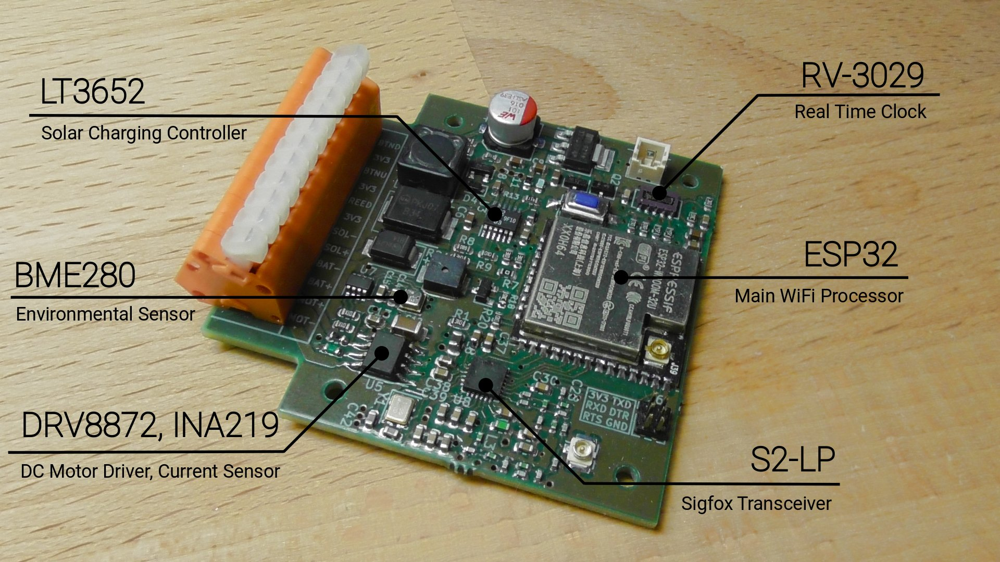
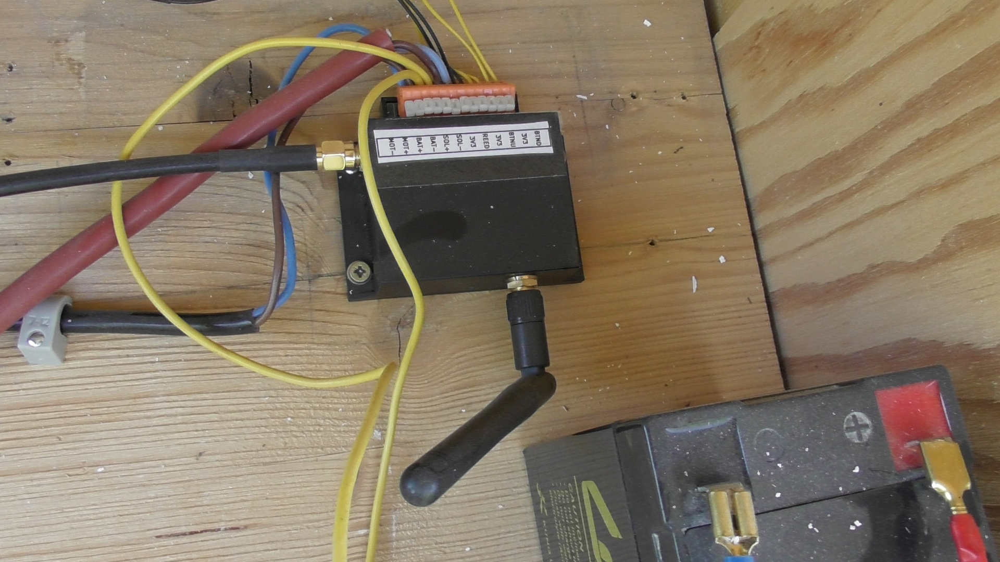
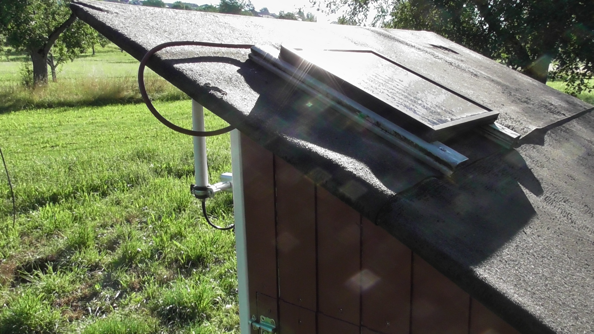

# Sigfox-Enabled Chicken Coop Controller

This repository contains hardware design files as well as firmware source code for a chicken coop controller board. The tiny controller (approx. 50x50mm) automatically opens and closes the chicken coop's door at scheduled times of day. It also transmits environmental data (e.g. temperature, humidity) via the Sigfox network and uses a solar chell to recharge a connected lead-acid battery.

The device operates in conjunction with a web service that uses the Sigfox API to retrieve the latest messages and that provides the current configuration and time of day to the controller. The web service has an end user-facing frontend that displays environmental data, device status information and lets the user configure door opening / closing times.

As a whole, this project probably isn't particularly useful for you since it represents a rather customized solution. Parts of it though may be of interest, e.g. the S2-LP transmitter design, the solar charger design or the firmware, which can be used as reference for how to integrate [renard-phy-s2lp](https://github.com/jeija/renard-phy-s2lp), an open source Sigfox PHY based on the open-source Sigfox stack [librenard](https://github.com/jeija/librenard) into an ESP32 project.

## Hardware Design
The controller mainly consists of the following components:

* An ESP32 microcontroller with integrated WiFi. WiFi functionality is only used for Over-the-Air (OTA) updating
* An S2-LP transceiver for Sigfox uplink and downlink, the RX balun / impedance matching is implemented with discrete components
* A LT3652 solar charging controller for lead-acid battery charging
* A RV-3029-C2 Real Time Clock (RTC)
* A BME280 environmental sensor for measuring temperature, pressure and humidity
* A DRV8872 as DC motor driver with an INA219 for motor current measurement (stall detection) for the door, as well as an input for a reed contact

Everything is mounted on a tiny 50x50mm PCB which fits nicely into an off-the-shelf casing (Strapubox A515)

The system is is powered by a 12V/7.2Ah lead-acid battery, which is recharged by the solar panel on top of the chicken coop. The Sigfox antenna is also mounted outside for an increased link budget.

* [**Download PDF Schematic**](hardware_pdf/schematic.pdf)
* [**Download PDF PCB Layout**](hardware_pdf/pcb.pdf)
* [**KiCad Sources**](hardware)

## Firmware
The controller firmware is based on [esp-idf](https://github.com/espressif/esp-idf).
Sigfox functionality is based on [renard-phy-s2lp](https://github.com/jeija/renard-phy-s2lp) and [renard-phy-s2lp-hal-esp32](https://github.com/jeija/renard-phy-s2lp-hal-esp32), which are included as git suprojects. This means that you need to make sure to clone this repository with the `--recursive` flag.

The firmware supports over-the-air firmware updates via WiFi. This functionality is based on [esp32-softap-ota](https://github.com/Jeija/esp32-softap-ota).

### Configuration
For now, Sigfox device ID and secret key are configured directly in `firmware/main/src/sigfox.c`, see variables `sigfox_key` and `sigfox_devid`. The provided default values are those that I published during [my Sigfox reverse engineering presentation](https://jeija.net/sigfox/), so they are known to be compromised!

Watch that presentation to learn more about device ID and secret key (=NAK) and where to obtain yours.

### Initial Build and Flash
Make sure you have a recent [esp-idf](https://github.com/espressif/esp-idf) version with support for cmake-based projects installed and configured properly. Then compile and flash this project as usual using the following steps:

* `idf.py all` to compile everything
* `idf.py -p /dev/ttyUSBX flash` to flash everything

### Over-the-Air Firmware Update
Compile the firmware as described previously and obtain the firmware binary at `firmware/build/sigfox-chicken-door.bin`.

Press both buttons of the chicken coop (up and down) simultaneously until the controller starts beeping regularly. This indicates that it is ready to receive updates.

The controller broadcasts a WiFi network with SSID `ESP32 OTA Update` and acts as an HTTP server. Connect to it, open the webpage at [192.168.4.1](http://192.168.4.1) and use the form to upload the binary. The webpage will show the update progress.

You can also use the `compile_and_post.sh` script to automatically perform the OTA firmware update, which might be useful during development.

## Web Component
The web component connects to the Sigfox API to provide downlinks (e.g. open / close time configuration) to the controller, analyze uplinks and visualize information.

This component is currently not public, but feel free to contact me if you have any questions regarding it.